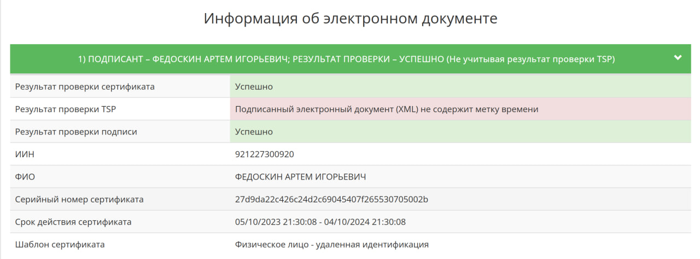

# Отчет работы и результата сервиса idocs.kz

> Результатом анализа является ответ на вопрос:
>
> - Как интегрировать подписи системы, так чтобы они могли проверяться на check.doodocs.kz?

#### Какой тип подписи? - XML, CMS, etc.

> - `.xml` файл, каждого подписанта

#### Как выглядит подписанный документ, который подтверждает факт успешного подписания?

> - Это `.zip` архив, который содержит в себе папку (с наванием подписываемого документа и номером документа, котрый вы указываете на сайте). Непосредственно в этой папке находятся 3 файла:
>   - Оригинал документа
>   - Паспорт документа (`.pdf` документ, содержащий в себе информацию о подписантах и изменениях в отправке документа)
>   - Печатная форма вашего документа
> - Еше N (кол-во подписантов) директорий (папок) в каждой из которых лежит подпись подписанта в формате `.xml` > 

#### Что конкретно подписывается? - Хеш, бинарные данные, UUID документ и т.д.

> - Хэш вашего документа

#### Как проверяется на сервисе?

> - Непосредственно сервиса проверки подписанного документа на легитимность нет. Но на странице с документом может быть флаг "Подписан/Ожидает подписания/Отправлен/Черновик" что и являеся их проверкой.
>    >  >  > 

#### Как можно проверить подпись вне этого сервиса?

> - Проверить легитимность подписи можно на сайте https://ezsigner.kz/#!/checkCMS, отправив `.xml` подпись каждого подписанта отдельно.

## HTTP-запросы

### №1. Загрузка документа

- Данный ниже `curl` запрос может отправить документ и создать его в разделе "Внешние/Черновики", в ответ вы получите json response о успешном создании документа.
- Так же вы можете заметить в комментариях флаг `{omitempty}` если убрать поля под ним и отправить запрос без них, то в ответ так же придет json response о успешном создании документа, но в разделе "Внешние/Черновики" документ не появится:)
- При отправке запроса не забудьте заменить "`...`" на значения подходящего типа.
- Указать полный путь вместо `<filepath>`.
- А также если установить значения в поле `Category=0`, то в ответ так же придет json response о успешном создании документа, но в разделе "Внешние/Черновики" документ не появится:)
- Если установить `CreationType` в значении `2`, то документ можно будет просмотреть и при его скачивании никаких проблем не возникает, а вот в остальных значенияx `1/3/4` документ нельзя просмотреть и при скачивании выдает ошибку или скачивает пустой архив.
- `DocumentGroupId` есть 10 значений для каждого вида докумена:

Юридические

- a3fa4c08-34fa-428d-afc5-7073c9fcab69

Бухгалтерские

- 4484d2e5-ec9c-4715-8ac9-46dc90e32594

Складские

- ab79b353-820b-4afd-87dd-4e8e10f633bf

Кадровые

- eb1d1a24-5d62-4db5-9586-2591d2d195b7

Служебные

- 50e5f2fb-b93a-476d-9ac9-84c5fa29d584

Финансовые

- d5bbceda-3276-483a-8688-da77d8427b28

Учредительные

- ffd87147-84f4-41a9-ad39-fba1cf200e9c

Организационно-правовые

- 8cf4366c-ece9-41e5-862d-cfbcd4ae60d8

Закупки

- c2d3f988-c359-42f7-bc7f-b2b459b1bc27

Прочие

- 0cea3b9b-ac5e-407e-a79e-6292df9d4981

#### `POST` Запрос:

```sh
curl --location 'https://api.idocs.kz/api/v2/reference/fact-documents/iDocsApi.create-with-file' \
--header 'Authorization: Bearer Token ...' \
# Number string {omitempty}
--form 'Number="..."' \
# Name string
--form 'Name="..."' \
# {omitempty}
--form 'Date="YYYY-MM-DDTHH:MM:SS.sssZ"' \
# CreationType int32 от 0 до 4 {omitempty}
--form 'CreationType="..."' \
# {omitempty}
--form 'File=@"<filepath>"' \
# Category int32 есть два значения (0 и 1)
--form 'Category="..."' \
# DocumentGroupId uuid
--form 'DocumentGroupId="..."'
```

Ответ:

```json
{
  "@odata.context": "https://api.idocs.kz/api/v2/reference/$metadata#iDocsApi.ApiSuccessResponseModel_1OfGuid",
  "Header": "Успешно",
  "Description": "Документ с номером ... успешно создан",
  "Payload": "e56a18df-1c27-4df3-314b-08dbe238765a"
}
```

### №2. Отправка подписи

1. Получение документа для подписывания его NCAlayer-ом (так работает _idocs_)

- Для того чтобы отправить подпись нужно загрузить документ (с помощью `curl` запроса выше). Взять с ответа значение(`UUID`) с ключа `"Payload"`

- Потом отправить `curl` запрос подписания документа, он выдаст нам `.xml` файл такого вида:

```http
<root><data>XXX<data><timestamp>YYY</timestamp></root>

```

- Вместо `{Payload}` вставьте `UUID` которое мы взяли с прошлого ответа.

```sh
 curl --location --request GET 'https://api.idocs.kz/api/v2/sign/{Payload}' \
   --header 'Accept: application/json, text/plain, */*' \
   --header 'Authorization: Bearer ...' \
   --header 'Content-Type: application/json' \
```

Ответ:

```json
{
  "FactDocumentId": "{Payload}",
  "ContentList": [
    {
      "FileId": "UUID...",
      "Content": "<root><data>1....XXX...</data><timestamp>...YYY...</timestamp></root>",
      "Ticket": "content_ticket_...."
    }
  ],
  "StepId": null,
  "StageId": null,
  "PositionName": null
}
```

- Сохраняем значения `"Content"`, он нам пригодится.

2. Подписываем документ с помощью NCAlayer-а

!**_idocs подписывает непосредственно сам хэш соданного вами документа, то есть по закону электронным документом считается этот самый хэш файл_**!

- И так чтобы подписать документ нам нужно создать подключение(connect) к webSocket-у(имеено так _idocs_ отправляет запрос на подписание NCAlayer-у)
- Можете попробывать через приложение _webSockat_ или _PostMan_
- В моем случае я воспользуюсь _PostMan_-ом
- Итак заходим в _PostMan_ меняем `request type` с `HTTP` на `WebSocket`
- Вводим такой `URL`: wss://127.0.0.1:13579/ (P.S. у вас должен быть включен NCAlayer)
- Во вкладке `Message` заполняем вот так:

  ```json
  {
    "method": "signXmls",
    "module": "kz.gov.pki.knca.commonUtils",
    "args": ["PKCS12", "SIGNATURE", ["...Content..."], "", ""]
  }
  ```

  - Вместо `...Content...` вставляем что мы получили предыдущим запросом в ключе `Content`

Ответ:

```json
{
  "responseObject": [
    "<?xml version=\"1.0\" encoding=\"UTF-8\" standalone=\"no\"?><root><data>...XXX...</data><timestamp>...YYY...</timestamp><ds:Signature xmlns:ds=\"http://www.w3.org/2000/09/xmldsig#\">\n<ds:SignedInfo>\n<ds:CanonicalizationMethod Algorithm=\"http://www.w3.org/TR/2001/REC-xml-c14n-20010315\"/>\n<ds:SignatureMethod Algorithm=\"http://www.w3.org/2001/04/xmldsig-more#rsa-sha256\"/>\n<ds:Reference URI=\"\">\n<ds:Transforms>\n<ds:Transform Algorithm=\"http://www.w3.org/2000/09/xmldsig#enveloped-signature\"/>\n<ds:Transform Algorithm=\"http://www.w3.org/TR/2001/REC-xml-c14n-20010315#WithComments\"/>\n</ds:Transforms>\n<ds:DigestMethod Algorithm=\"http://www.w3.org/2001/04/xmlenc#sha256\"/>\n<ds:DigestValue>...</ds:DigestValue>\n</ds:Reference>\n</ds:SignedInfo>\n<ds:SignatureValue>\n...</ds:SignatureValue>\n<ds:KeyInfo>\n<ds:X509Data>\n<ds:X509Certificate>...</ds:X509Certificate>\n</ds:X509Data>\n</ds:KeyInfo>\n</ds:Signature></root>"
  ],
  "code": "200"
}
```

- В итоге мы получим `.xml` файл нашей подписи
  P.S.: Полученный `.xml` файл это тот же файл что _idocs_ отправляет нам при скачивания оригинала и подписей с их сервиса в папках подписантов(папка с `.xml` подписью)

## Описание подписанного документа

1. **_Оригинал документа_**
   - Это изначальный документ, который вы как клиент загрузили на сайт и редактировали или же созданный вами документ с помощью редактора/шаблона на сайте.
2. **_Паспорт докмуента_**
   - Это `.pdf` файл в котором хранится информация о документе и подписантах.
   - Сначала идет дата скачивания подписанного файла.
   - Далее таблица, в первой секции которой содержится небольшая информация о документе: категория, название, ссылка на документ, статус подписи.
   - В следующей секции описана информация о "Отправителе" документа: наименование компании/ФИО физ. лица и БИН/ИИН (соответсвенно). Так же описана информация о "Получателях". На этом таблица заканчивается.
     
   - "Отправитель" и "Получатели" являются подписантами документа.
   - Далее ниже идут уже детали о подписантах: их ФИО, наименования компаний(если документ подписывали от юр. лица), должности, виды подписей, издатели, серйнные номера сертификатов, дата и время когда подписант подписал документ, действительность сертификата на момент подписания и часть хэша подписи.
     
   - Далее идет история докумета внутрии компании с ФИО сотрудника, датой и временем определенного действия.
     
   - И в конце описывается история документа по контрагентам также с датой и временем
     
3. **_Печатная форма_**
   - Это `.pdf` файл который содержит в себе ваш оригинальный документ, но с добавлением небольшой информации от _idocs_, ссылкой и qr-кодом, содержащий ссылку на просмотр вашего документа в сервисе _idocs_.
     
   - Так же если вы не использовали шаблоны представленные в сервисе, а загрузили или создали с помощью редактора документы. То в печатной форме по левый край документа будут qr-коды, содержащие в себе информацию о подписантах, а именно:
     - Название компании, если это юр. лицо, иначе там будет ФИО физ. лица.
     - ФИО работника или физ лица
     - Должность работника или "Физ. лицо" для физю лиц
     - Дата подписания документа
       ```
           Компания: Тестов Тест Тестулы
           ФИО: Тестов Тест Тестулы
           Должность: Физ. лицо
           Дата подписания: ДД.ММ.ГГГГ ЧЧ:ММ:СС
       ```
4. **_Папки с подписью_**
   - Папок столько же сколько и подписантов. Названия папок начинается со слова "Подпись" и далее идет ФИО подписантов. В каждой папке находится `.xml` файл.

## Описание подписей

> Для детального описания подписей, проведем анализ .xml-файла одного из подписанта,который содержит закодированные данные вместе с цифровой подписью.

**Структура документа**

`<data>` - здесь содержится строка данных в закодированном виде/хэш.
`<timestamp>` - закодированная строка о метке времени
`<ds:Signature>` -  это блок, содержащий цифровую подпись, созданную с использованием стандарта XML Digital Signature. 
- `<ds:SignedInfo>`- этот блок содержит информацию о подписываемых данных и алгоритмах, используемых для подписи.
    - `<ds:CanonicalizationMethod>`- определяет метод каноникализации, который применяется к подписываемым данным.
    - `<ds:SignatureMethod>`- указывает алгоритм, используемый для генерации подписи.
    - `<ds:Reference URI="">` - этот элемент ссылается на данные, которые подписываются.

    - `<ds:Transforms>` - содержит информацию о преобразованиях, применяемых к данным перед их подписью.
    - `<ds:DigestMethod>`- алгоритм хэширования, используемый для создания дайджеста данных.
    - `<ds:DigestValue>`- значение хэша, созданное на основе данных.
- `<ds:SignatureValue>` - значение цифровой подписи, созданное на основе данных.
- `<ds:KeyInfo>`: Содержит информацию о ключе, использованном для создания подписи. В данном случае, используется X.509 сертификат.
    - `<ds:X509Certificate>` - это сертификат X.509, который содержит открытый ключ, используемый для подписи данных.

#### Что конкретно подписывается? - Хеш, бинарные данные, UUID документ и т.д.
 - сервис передает на подписание не электронный, оригинальный документ, а созданный хэш документа.


#### Как формируется хэш?

Документ, который подлежит подписанию, подвергается процессу хеширования на серверной стороне и передается на клиентскую сторону в формате JSON.


Элемент "content" включает в себя информацию, представленную данными (хэш документа) и меткой времени. Эта информация находится в структуре XML-файла.


*Данные были получены путём извлечения их со страниц веб-ресурсов(веб-скрапинг)

## Описание процесса верификации подписей на сервисе

> \*Данный текст не является частью анализа и нужно удалить при сдаче.
>
> В этом разделе нужно описать процессы того, как сервис предлагает проверить подпись на легитимность. Перечислить все доступные методы рекомендованные сервисом. Возможно данная информация будет храниться в статьях, блогах или FAQ сервиса.
>
> Можно прилагать скрины.

## Описание процесса верификации подписей вне сервиса

Как пример берется **ezSigner.kz**

1. При сабмишне подписи срабатывается функция **checkFile**, которая в первую очередь проверяет размер файла.
2. Так же проверяется дата подписи, которую пользователь заполняет сам. Хочется отметить, что непонятна требуемость даты подписи если дата может хранится в самой подписи.
   
3. Далее, если размер файла не привышает лимит, то дальше выполняется функция **checkFileOnServer**, где выполняется отправка подписи на сервер по URL **/checkSign**
   
4. Пример ответа:

```json
{
  "code": "200",
  "message": null,
  "responseObject": {
    "type": "xml",
    "date": null,
    "signerInfos": [
      {
        "number": 0,
        "iin": "921227300920",
        "name": "ФЕДОСКИН АРТЕМ ИГОРЬЕВИЧ",
        "bin": null,
        "organizationName": null,
        "serialNumber": "27d9da22c426c24d2c69045407f265530705002b",
        "certificateValidityPeriod": "05/10/2023 21:30:08 - 04/10/2024 21:30:08",
        "sigantureAlgorithm": null,
        "tspDate": null,
        "checkDate": "2023-11-06",
        "certificateVerificationResult": {
          "message": null,
          "valid": true
        },
        "tspVerificationResult": {
          "message": "Подписанный электронный документ (XML) не содержит метку времени",
          "valid": false
        },
        "signatureVerificationResult": {
          "message": null,
          "valid": true
        },
        "certtemplateName": "Физическое лицо - удаленная идентификация",
        "validTimestamp": false,
        "personCertificate": true,
        "validSignature": true
      }
    ]
  },
  "responseObjects": null
}
```
5. Пример ответа на фронте:
   